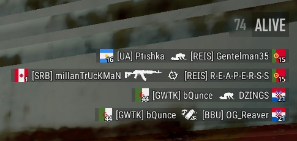
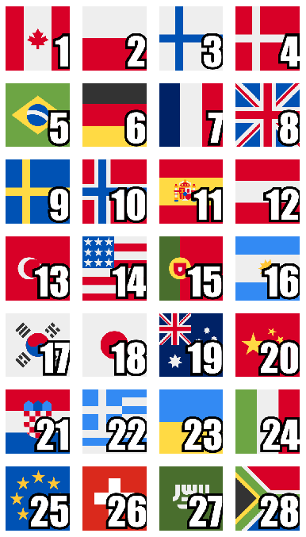

# Flags in PUBG killfeed by Ciseur
## Flags with numbers in your PUBG killfeed
This project provides files to customize your PUBG killfeed with flags instead of the default numbers.

This is based on Kowo version shared on his [YouTube video](https://www.youtube.com/watch?v=8OWbQ_wXhpk). The order of flags is consistent, so you can play with someone using his version.

Loved the idea of flags. They are easier to remember and always liked them. I created this project to improve the readability and add numbers to provide compatibility if you play with people not using the flags.

The flags are from [kapowaz](https://kapowaz.github.io/square-flags/).

## Install
To get flags in your PUBG killfeed:

1. Open your windows file explorer and go to %LOCALAPPDATA%\TslGame\Saved
2. Paste "TeamInfo.csv" file and the "TeamIcon" directory
3. Restart PUBG
4. Profit