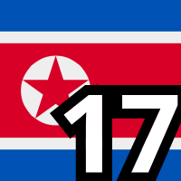

# Flags in PUBG killfeed by Ciseur
##Support my work
If you want to buy me a coffee, you can do it on [my paypal page](https://paypal.me/ciseur).

## Flags with numbers in your killfeed
This project provides files to customize your PUBG killfeed with flags instead of the default numbers.

This is based on Kowo version shared on his [YouTube video](https://www.youtube.com/watch?v=8OWbQ_wXhpk). The order of flags is consistent, so you can play with someone using his version.

Loved the idea of flags. They are easier to remember and always liked them. I created this project to improve the readability and add numbers to provide compatibility if you play with people not using the flags.

The flags are from [kapowaz](https://kapowaz.github.io/square-flags/).

## Install
To get flags in your PUBG killfeed:

1. Download the [most recent archive on github](https://github.com/Ciseur/ciz-pubg-killfeed-flags/releases)
2. Open your windows file explorer and go to %LOCALAPPDATA%\TslGame\Saved
3. Paste "Observer" directory there (it musts contains "TeamInfo.csv" file and the "TeamIcon" directory)
4. Restart PUBG
5. Profit

## List of flags with names

|||||
| -- | -- | -- | -- |
| Canada| Poland| Finland| Denmark|
| Brazil| Germany| France| United Kingdom|
| Sweden| Norway| Spain| Austria|
| Turkey| USA| Portugal| Argentina|
| Korea| Japan| Australia| China|
| Croatia| Greece| Ukraine| Italy|
| Europe| Switzerland| Saudi Arabia| South Africa|
| Morocco| Thailand| Israel| Jamaica|
| Cuba| Uruguay| Colombia| Congo|
| India| Kenya| Wales| Czechia|
| Scotland| Kazakhstan| Ireland| Algeria|
| Romania| Angola| Bahamas| Greenland|
| Olympics| Pirate|
