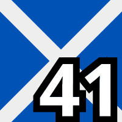

# Flags in PUBG killfeed by Ciseur
## Flags with numbers in your PUBG killfeed
This project provides files to customize your PUBG killfeed with flags instead of the default numbers.

This is based on Kowo version shared on his [YouTube video](https://www.youtube.com/watch?v=8OWbQ_wXhpk). The order of flags is consistent, so you can play with someone using his version.

Loved the idea of flags. They are easier to remember and always liked them. I created this project to improve the readability and add numbers to provide compatibility if you play with people not using the flags.

The flags are from [kapowaz](https://kapowaz.github.io/square-flags/).

## List of flags with names

1.  Canada
2.  Poland
3.  Finland
4.  Denmark
5.  Brazil
6.  Germany
7.  France
8.  United Kingdom
9.  Sweden
10.  Norway
11.  Spain
12.  Austria
13.  Turkey
14.  USA
15.  Portugal
16.  Argentina
17.  Korea
18.  Japan
19.  Australia
20.  China
21.  Croatia
22.  Greece
23.  Ukraine
24.  Italy
25.  Europe
26.  Switzerland
27.  Saudi Arabia
28.  South Africa
29.  Morocco
30.  Thailand
31.  Israel
32.  Jamaica
33.  Cuba
34.  Uruguay
35.  Colombia
36.  Congo
37.  India
38.  Kenya
39.  Wales
40.  Czechia
41.  Scotland
42.  Kazakhstan
43.  Ireland
44.  Algeria
45.  Romania
46.  Angola
47.  Bahamas
48.  Greenland
49.  Olympics
50.  Pirate

## Install
To get flags in your PUBG killfeed:

1. Download the [most recent archive on github](https://github.com/Ciseur/ciz-pubg-killfeed-flags/releases)
2. Open your windows file explorer and go to %LOCALAPPDATA%\TslGame\Saved
3. Paste "Observer" directory there (it musts contains "TeamInfo.csv" file and the "TeamIcon" directory)
4. Restart PUBG
5. Profit