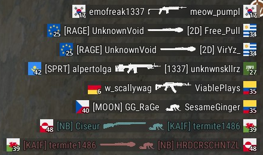
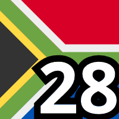

# Flags in PUBG killfeed by Ciseur
## Flags with numbers in your PUBG killfeed
This project provides files to customize your PUBG killfeed with flags instead of the default numbers.

This is based on Kowo version shared on his [YouTube video](https://www.youtube.com/watch?v=8OWbQ_wXhpk). The order of flags is consistent, so you can play with someone using his version.

Loved the idea of flags. They are easier to remember and always liked them. I created this project to improve the readability and add numbers to provide compatibility if you play with people not using the flags.

The flags are from [kapowaz](https://kapowaz.github.io/square-flags/).

## List of flags with names

1. Canada 
2. Poland 
3. Finland 
4. Denmark 
5. Brazil 
6. Germany 
7. France 
8. United Kingdom 
9. Sweden 
10. Norway 
11. Spain 
12. Austria 
13. Turkey 
14. USA 
15. Portugal 
16. Argentina 
17. Korea 
18. Japan 
19. Australia 
20. China 
21. Croatia 
22. Greece 
23. Ukraine 
24. Italy 
25. Europe 
26. Switzerland 
27. Saudi Arabia 
28. South Africa 
29. Morocco 
30. Thailand 
31. Israel 
32. Jamaica 
33. Cuba 
34. Uruguay 
35. Colombia 
36. Congo 
37. India 
38. Kenya 
39. Wales 
40. Czechia 
41. Scotland 
42. Kazakhstan 
43. Ireland 
44. Algeria 
45. Romania 
46. Angola 
47. Bahamas 
48. Greenland 
49. Olympics 
50. Pirate 

## Install
To get flags in your PUBG killfeed:

1. Download the [most recent archive on github](https://github.com/Ciseur/ciz-pubg-killfeed-flags/releases)
2. Open your windows file explorer and go to %LOCALAPPDATA%\TslGame\Saved
3. Paste "Observer" directory there (it musts contains "TeamInfo.csv" file and the "TeamIcon" directory)
4. Restart PUBG
5. Profit